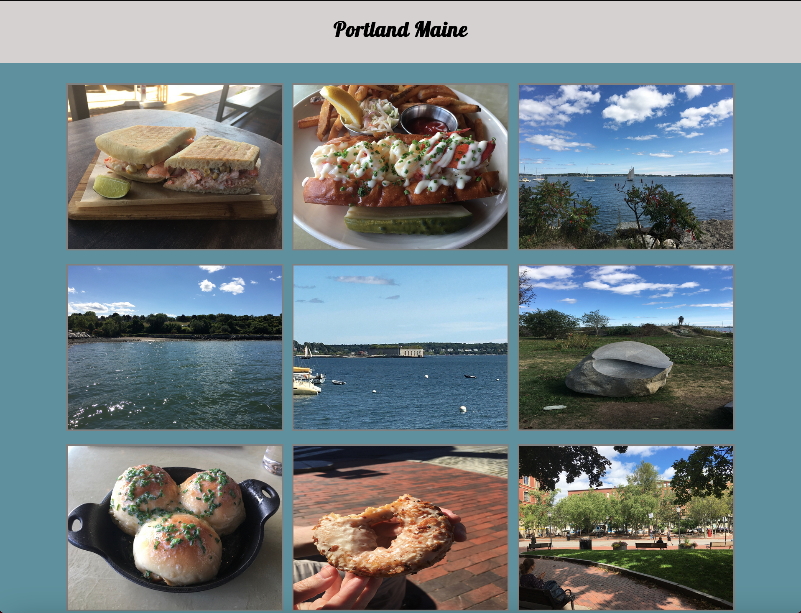

## How to use this Project
From your terminal, download the files using
```
$ git clone https://github.com/leeb2828/vacation-photo-gallery
```
A virtual environment is a tool that helps to keep dependencies required by
different projects separate from each other by using isolated virtual environments.
The venv module comes pre installed with Python 3.5 + versions.
Create your virtual environment
```
$ python3 -m venv env
$ source env/bin/activate
```
I created the requirements.txt file using the pip freeze command.
Install all dependencies from the requirements.txt file.
```
$ pip install -r requirements.txt
```
Run the app.py file
```
$ python3 app.py
```
Type in http://localhost:5000 or http://127.0.0.1:5000 into your browser to view the project live.
Type in CTRL-C to stop running the server.

To deactivate your environment:
```
$ deactivate
```
<br />


When the user selects one of the following vacations on the index.html page: 
- Acadia National Park 
- Panama city Beach 
- Portland Maine 
- Snoqualmie Falls Park 
- Valley Forge National Park. 
<br />
The user will be redirected to the photo_gallery.html page with the location displayed at the top and
all the photos from that vacation dynamically displayed on the page.


